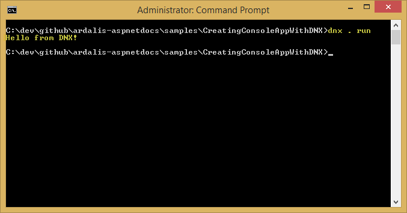

Erstellen eine plattformübergreifende Konsolen-App mit DNX
==========================================================

Von Steve Smith

Verwenden die ausführungsumgebung von .NET (DNX), ist es sehr einfach, eine einfache Konsolen-Anwendung auszuführen.

In diesem Artikel:

- Erstellen einer Konsolenanwendung
- Angeben von Projekteinstellungen
- Ausführen der Anwendung

Sie können [anzeigen und Herunterladen von der Quelle](https://github.com/aspnet/Docs/tree/master/samples/CreatingConsoleAppWithDNX) aus dem Projekt, das in diesem Artikel erstellt.

Erstellen einer Konsolenanwendung
---------------------------------

Bevor Sie beginnen, stellen Sie sicher, dass Sie erfolgreich DNX auf Ihrem System installiert haben:

- [Unter Windows installieren](installing-core-windows.md)
- [Installation auf Mac OS X](installing-core-osx.md)
- [Installation unter Linux](installing-core-linux.md)

Öffnen Sie eine Konsolen- oder terminal-Fenster in einen leeren Arbeitsordner, in denen `Dnx` konfiguriert ist.

Erstellen ein Konsolenanwendungsprojekt ist äußerst einfach.
In diesem Artikel werden wir die folgende C\-Klasse verwenden, die nur eine Zeile mit ausführbarem Code aufweist:

Es nicht wirklich ein einfacher abgerufen werden.
Erstellen Sie eine Datei mit diesem Inhalt, und speichern Sie sie als `"Program.cs"` im aktuellen Ordner.

Angeben von Projekteinstellungen
--------------------------------

Als Nächstes müssen wir die eingestellte bereitstellen, die DNX verwendet wird.
Erstellen Sie ein neues `project.json` -Datei im gleichen Ordner und bearbeiten, um die hier angezeigten Liste übereinstimmen:

Speichern Sie die Änderungen.

Ausführen der Anwendung
-----------------------

An diesem Punkt sind wir bereit, um die Anwendung auszuführen.
Sie können hierzu einfach ' Dnx.
Führen Sie "von der Befehlszeile aus.
Ein Ergebnis wie der folgenden sollte angezeigt werden:

> **Hinweis:**
> 
> `Dnx` verweist auf mehrere [Umgebungsvariablen](https://github.com/aspnet/Home/wiki/Environment-Variables), wie z. B. `DNX_TRACE`, wirken sich auf das Verhalten.

Legen Sie die `DNX_TRACE` -Umgebungsvariable auf 1, und führen Sie die Anwendung erneut aus.
Sehr viel mehr Ausgabe sollte angezeigt werden:

Das Standardverhalten für DNX werden in diesem Beispiel auf der Windows-Plattform auf die Vollversion von .NET Framework ausgeführt werden.
Können Sie durch Ausführen die CoreCLR Verwendung wechseln `Dnvm upgrade - R CoreCLR`.
Um wieder zu .NET CLR verwenden, führen Sie `Dnvm upgrade - R CLR`.

Sie können sehen, dass die app weiterhin nach dem Wechsel zur Verwendung von CoreCLR ausgeführt:

Zusammenfassung
---------------

Erstellen und Ausführen Ihrer erste Konsolenanwendung auf DNX ist Verysimple und erfordert nur zwei Dateien.

