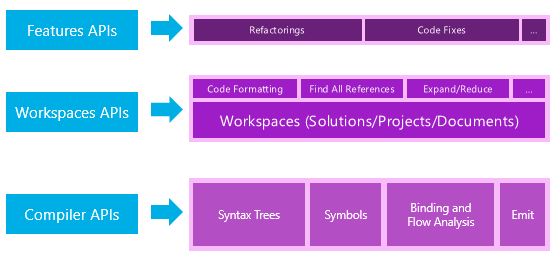
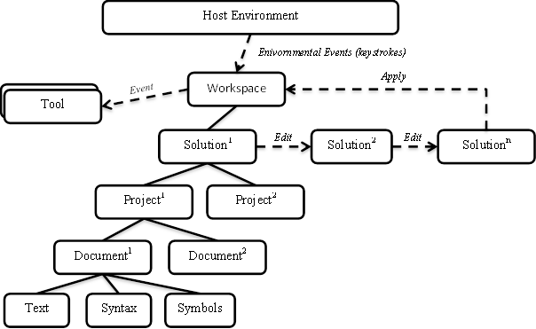

Übersicht über die .NET Compiler Platform ("Roslyn")
====================================================

Inhalt dieses Dokuments
-----------------------

-   [Einführung](#introduction)
-   [Verfügbarmachen der Compiler-APIs](#exposing-the-compiler-apis)
   -   [Funktionale Compilerpipeline
Bereiche](#compiler-pipeline-functional-areas)
   -   [API-Ebenen](#api-layers)
      -   [Compiler-APIs](#compiler-apis)
      -   [Arbeitsbereiche-APIs](#workspaces-apis)
-   [Arbeiten mit der Syntax](#working-with-syntax)
   -   [Syntaxstrukturen](#syntax-trees)
   -   [Syntax von Knoten](#syntax-nodes)
   -   [Syntax von Token](#syntax-tokens)
   -   [Faszinierende Syntax](#syntax-trivia)
   -   [Spannen](#spans)
   -   [Arten](#kinds)
   -   [Fehler](#errors)
-   [Arbeiten mit Semantik](#working-with-semantics)
   -   [Kompilierung](#compilation)
   -   [Symbole](#symbols)
   -   [Semantikmodell](#semantic-model)
-   [Arbeiten mit einem Arbeitsbereich](#working-with-a-workspace)
   -   [Arbeitsbereich](#workspace)
   -   [Projektmappen, Projekte und
Dokumente](#solutions-projects-documents)

Einführung
----------

In der Vergangenheit werden schwarze Felder - Quellcode in einem Ende geht,
Geheimnis liegt in der Mitte und Objektdateien oder Assemblys stammen die
andere Ende.
Compiler ihre Magic ausführen, erstellen sie umfassende
Verstehen des Codes diese verarbeitet werden, aber dieses Wissen ist.
für andere Personen als die Compiler-Implementierung-Assistenten nicht verfügbar.
Die
Informationen vergessen wird sofort, nachdem die konvertierte Ausgabe ist
erzeugt wurde.

Seit Jahrzehnten dieser Sichtweise hat uns gut bedient, aber es ist nicht mehr
ausreichend.
Bauen wir zunehmend auf IDE
(IDE) von Features wie z. B. IntelliSense, Umgestaltung, intelligente umbenennen
"Alle Verweise suchen" und "Gehe zu Definition" erhöhen unsere
die Produktivität.
Wir benötigen Codeanalysetools können Sie die Qualität des Codes zu verbessern.
und Code-Generatoren zur Unterstützung bei der Erstellung der Anwendung.
Wie diese tools
Intelligenter erhalten, müssen sie auf zu mehr und mehr Tiefe Code zugreifen
Kenntnisse, die nur für Compiler besitzen.
Dies ist der Kern-Auftrag, der die
.NET Compiler Platform ("Roslyn"): Öffnen Sie die schwarzen Felder und
Tools und Endbenutzer mit der Fülle von Informationen ermöglichen
Compiler sind über unseren Code.
Statt deckend Source Code in
und Objekt-Code-Out-Übersetzer über das .NET Compiler Platform
("Roslyn")-Compiler Plattformen werden – APIs, mit denen Sie für Code
Verwandte Aufgaben in Ihre Tools und Programme.

Der Übergang zu Compiler als Plattformen deutlich gesenkt die Barriere
Eintrag für das Erstellen von Code gezielten Tools und Programme.
Es wird erstellt
neue Chancen für Innovationen in Bereichen wie z. B. Metaprogrammierung
Generierung von Code und interaktive Transformation verwenden, von der C\- und VB
Sprachen und Einbetten von C\- und VB in domänenspezifische Sprachen.

Die SDK-Vorschau für .NET Compiler Platform ("Roslyn") enthält die neuesten
Entwürfe von neuen Sprache Objektmodelle für die Generierung von Code, Analyse und
Umgestaltung.
Wir hoffen, dass gehören Entwürfe von API-Unterstützung für Skripting und
Interaktive Verwendung von C\- und Visual Basic in einer zukünftigen Vorschau.
Dies
Dokument bietet eine Übersicht der Compiler
("Roslyn").
Weitere Details finden Sie in den exemplarischen Vorgehensweisen und Beispiele
in der Vorschau SDK enthalten.

Verfügbarmachen der Compiler-APIs
---------------------------------

###Funktionsbereiche des Compiler-Pipeline

Die .NET Compiler Platform ("Roslyn") verfügbar macht, die C\- und Visual Basic
Compilers-Codeanalyse für Sie als Consumer durch die Bereitstellung einer API-Schicht
spiegelt eine traditionelle compilerpipeline.


Jede Phase der diese Pipeline ist jetzt eine separate Komponente.
Zuerst die Analyse
Phase, wobei Quelle zerlegt und in der Syntax, die folgt analysiert die
Grammatik.
Zweite Phase der Deklaration, in denen Deklarationen aus
Quell- und importierte Metadaten werden zum Formular mit dem Namen Symbole analysiert.
Weiter
der Bind-Phase, die Bezeichner im Code, in dem Symbole zugeordnet sind.
Schließlich der Emit-Phase, in dem alle Informationen, durch erstellt die
Compiler wird als Assembly ausgegeben.


Für jede dieser Phasen ein Objektmodell verfügbar gemacht wird,
ermöglicht den Zugriff auf die Informationen in dieser Phase.
Die Analysephase ist.
die Deklaration Phase als hierarchische Symbol als eine Syntaxstruktur verfügbar gemacht
Tabelle, die Bindung Phase als ein Modell, das das Ergebnis des macht die
semantische Analysen des Compilers und der Emit-Phase als eine API, die erzeugt
IL-Byte-Codes.


Jeder Compiler kombiniert diese Komponenten zusammen als eine einzige End-to-end
insgesamt.

Um sicherzustellen, dass die öffentlichen Compiler-APIs zum Erstellen von ausreichen
Erstklassige IDE-Features, die Language-Dienste, die verwendet werden können
Schalten Sie die C\- und VB-Funktionen in Visual Studio vNext wurden
neu erstellt, deren Verwendung.
Zum Beispiel den Code Gliedern und Formatierung
Funktionen verwenden, die Syntaxstrukturen, den Objektbrowser und navigation
Funktionen verwenden die Symboltabelle Refactoringoptionen und Gehe zu Definition verwenden die
Semantikmodell, und bearbeiten und Fortfahren verwendet diese, einschließlich der
Reflektionsausgabe-API.
Dies können in Visual Studio 2013 Vorschau angezeigt werden soll
durch die Endbenutzer-Vorschau "Roslyn".
Diese Vorschau ist erforderlich
zum Erstellen und Testen Anwendungsentwicklung über den Compiler für .NET
Platform ("Roslyn") SDK für die Integration in Visual Studio jedoch vorgesehen
die .NET Compiler Platform ("Roslyn") APIs können in Ihren eigenen verwendet werden
Clientanwendungen unabhängig von Visual Studio ohne die
Vorschau für Endbenutzer.

###API-Ebenen

Die .NET Compiler Platform ("Roslyn") besteht aus zwei Hauptschichten der
APIs – die Compiler-APIs und Arbeitsbereiche-APIs.



###Compiler-APIs

Die Compiler-Ebene enthält die Objektmodelle, die entsprechen
Informationen zur Verfügung gestellt, in jeder Phase der Pipeline Compiler sowohl
syntaktische und semantische.
Die Compiler-Schicht enthält auch eine unveränderliche
Übersicht über einen einzelnen Aufruf eines Compilers, einschließlich der assembly
Verweise, Compileroptionen und Quellcodedateien.
Es gibt zwei
DISTINCT-APIs, die die C\-Programmiersprache und Visual Basic darstellen
die Sprache.
Diese beiden APIs in Form vergleichbar sind, aber speziell für die
High-Fidelity-von der jeweiligen Sprache.
Diese Schicht hat keine
Abhängigkeiten von Visual Studio-Komponenten.

####Diagnose-APIs

Als Teil ihrer Analyse kann der Compiler eine Reihe von Diagnosetests erzeugen.
die alles von Syntax, Semantik und definitive Zuweisung
Fehler in verschiedenen Warnungen und informationsdiagnosen.
Der Compiler
API-Schicht verfügbar macht, Diagnose mit einer erweiterbaren API ermöglicht
Benutzerdefinierte Analyzer in einer Kompilierung angeschlossen und benutzerdefinierte
Diagnose, darunter solchen, die durch Tools wie StyleCop oder FxCop, um
zusammen mit den vom Compiler definierten Diagnose erstellt werden.
Erzeugen
Diagnose auf diese Weise hat den Vorteil, natürlich integrieren
Tools wie MSBuild und Visual Studio die Diagnose für abhängen
wie Anhalten eines Builds auf Basis der Richtlinie und live anzeigen
Wellenlinien im Editor und vorschlagen Code behebt.

####Skripting APIs

Als Teil der Compiler-Ebene das Team Prototyp hosting/scripting
APIs für Codeausschnitte ausführen und Sammeln von Animationswerten während einer Ausführung zur Laufzeit
wird.
Die Textgröße für Replikation verwendet diese APIs, aber weder die Textgröße für Replikation noch die
Skripting APIs sind Teil des Projekts .NET Compiler Platform derzeit an.
Das Team wird diese Entwürfe vor der Einführung dieser erneut überprüfen
Komponenten.

####Arbeitsbereiche-APIs

Die Arbeitsbereiche Ebene enthält die Arbeitsbereich-API, die zum Starten
Zeigen Sie zum Ausführen der Codeanalyse und refactoring über vollständige Lösungen.
Es
unterstützt Sie beim Organisieren alle Informationen über die Projekte in einer
Lösung in einzelnen Objektmodell bietet Ihnen direkten Zugriff auf die
Konfigurieren von Compiler Ebenenmodellen Objekt ohne Dateien analysieren
Optionen oder Abhängigkeiten von Projekt zu Projekt verwalten.

Darüber hinaus Flächen eine Reihe von häufig verwendeten APIs die Arbeitsbereiche-Ebene
Beim Implementieren der Codeanalyse und Umgestaltung dieser Funktion Tools verwendet
innerhalb einer hostumgebung wie der Visual Studio-IDE, z. B. das Suchen
Alle Verweise, Formatierung und Code Generation-APIs.

Diese Schicht hat keine Abhängigkeiten auf Visual Studio-Komponenten.

Arbeiten mit der Syntax
-----------------------

Ist die grundlegendste Datenstruktur verfügbar gemacht werden, indem die Compiler-APIs der
Syntaxstruktur.
Diese Strukturen darstellen, die lexikalische und syntaktische-Struktur
der Quellcode.
Sie haben zwei wichtige Funktionen:

1.  Tools - ermöglichen, wie z. B. eine IDE-add-ins Codeanalysetools, und
Refactoringoptionen - anzeigen und verarbeiten die syntaktische Struktur
der Code im Projekt eines Benutzers.
2.  Aktivieren von Tools wie Refactoringoptionen und einer IDE - Erstellung
Ändern und Neuanordnen von Quellcode auf natürliche Weise ohne
Verwenden Sie die direkte Textbearbeitungsvorgänge.
   Erstellen und Bearbeiten von Strukturen, können tools
Erstellen und Ändern von Quellcode.

###Syntaxstrukturen

Syntaxstrukturen sind die primäre Struktur verwendet für die Kompilierung von code
Analyse, binden, Umgestaltung, IDE-Features und Generieren von Code.
Nein
ohne ihn zuerst zu identifizierenden ist Teil des Quellcodes angesehen.
und in einer von vielen bekannten strukturelle Sprache kategorisierte
Elemente.

Syntaxstrukturen müssen drei wichtige Attribute.
Das erste Attribut ist
Syntaxstrukturen halten die Quellinformationen Geschäftsnachrichten.
Dies
bedeutet, dass die Syntaxstruktur Informationen in jedes Datenelement enthält
den Quelltext, alle grammatischen Konstrukt, jede Lexikalischer Token und
alles zwischen Leerzeichen, Kommentare und
Präprozessordirektiven.
Beispielsweise jedes Literal gemäß der
Quelle wird dargestellt, wie er eingegeben wurde.
Die Syntax auch Strukturen
Fehler im Quellcode darstellen, wenn das Programm nicht vollständig ist oder
Ungültige durch, die übersprungene oder fehlende Token in der Syntaxstruktur darstellt.

Dadurch wird das zweite Attribut Syntaxstrukturen.
Syntax-Struktur
der Parser abgerufenes ist vollständig roundtripfähige wieder auf den text
Es wurde von analysiert.
Von einem beliebigen Knoten Syntax ist es möglich, den Text abrufen
Darstellung der Teilstruktur Stamm an diesem Knoten.
Dies bedeutet, dass
Syntaxstrukturen können als eine Möglichkeit zum Erstellen und Bearbeiten von Quelltext verwendet werden.
Von
Erstellen einer Struktur spezifischsten erstellt haben den entsprechenden Text ein, und
Bearbeiten einer Syntaxstruktur, erstellen eine neue Struktur von Änderungen an einer
vorhandene Struktur Sie effektiv den Text bearbeitet haben.

Das dritte Syntaxstrukturen-Attribut ist, dass sie unveränderlich sind und
Thread-sicher.
Dies bedeutet, dass nach eine Struktur abgerufen wird, eine Momentaufnahme ist
des aktuellen Status des Codes und nie geändert wird.
Auf diese Weise können
mehrere Benutzer gleichzeitig in derselben Syntaxstruktur interagieren
andere Threads ohne Sperren oder Duplizierung.
Da die Strukturen sind
unveränderlich und keine Änderungen wird direkt an eine Struktur Factory
Erstellen und Ändern von Syntaxstrukturen durch Erstellen weiterer Methoden-Hilfe
Momentaufnahmen der Struktur.
Die Strukturen sind effizient, die sie wiederverwenden
zugrunde liegende Knoten, damit die neue Version schnell und mit wenig neu erstellt werden können
zusätzlicher Speicher.

Syntax-Struktur gibt es buchstäblich einer Baumstruktur, nicht-terminal
die strukturellen Elemente übergeordnete andere Elemente.
Jede Syntaxstruktur besteht aus
der Knoten, Token und faszinierende.

###Syntax von Knoten

Syntax Knoten gehören die Hauptelemente des Syntaxstrukturen.
Diese
Knoten darzustellen Syntaktische Konstrukte wie Deklarationen, Anweisungen,
Klauseln und Ausdrücken.
Jede Kategorie Syntax Knoten dargestellt wird.
durch eine separate Klasse, die von SyntaxNode abgeleitet werden.
Ist der Knotenklassen
nicht erweiterbar.

Alle Syntax Knoten sind nicht-Terminal-Knoten in der Syntaxstruktur, d. h.
Sie haben immer andere Knoten und Token als untergeordnete Elemente.
Als untergeordnetes Element
ein anderer Knoten jeder Knoten verfügt über einen übergeordneten Knoten, der über zugegriffen werden kann
Die Parent-Eigenschaft.
Da Knoten und Strukturen unveränderlich sind das übergeordnete Element
ändert sich nie eines Knotens.
Der Stamm der Struktur wurde als übergeordnetes Element null.

Jeder Knoten verfügt über eine ChildNodes-Methode, die eine Liste der untergeordneten Knoten zurückgibt
in sequenzieller Reihenfolge basierend auf der Position des Quelltexts.
Diese Liste
enthält keine Token.
Jeder Knoten besitzt außerdem eine Auflistung von Nachfolger
SQLServer: Zugriffsmethoden – z. B. DescendantNodes, DescendantTokens oder DescendantTrivia
- eine Liste aller Knoten, Token oder faszinierende, die vorhanden darstellen
in der Teilstruktur, die von diesem Knoten als Stammknoten.

Zusätzlich stellt jede Syntax Knoten Unterklasse dieselben untergeordneten Elemente
über stark typisierte Eigenschaften.
Angenommen, ein BinaryExpressionSyntax
Node-Klasse hat drei zusätzliche Eigenschaften, die speziell für binäre Operatoren:
Links, OperatorToken und rechts.
Der Typ des Links und rechts
ExpressionSyntax und den Typ des OperatorToken ist SyntaxToken.

Einige Knoten Syntax über optionale untergeordnete Elemente verfügen.
Angenommen, ein
IfStatementSyntax ist eine optionale ElseClauseSyntax.
Wenn das untergeordnete Element nicht
vorhanden, die Eigenschaft gibt Null zurück.

###Syntax von Token

Syntax-Token sind die Terminals der Language-Grammatik darstellt
die kleinste syntaktische Fragmente des Codes.
Sie werden nie übergeordneten Elementen von
andere Knoten oder Token.
Syntax von Token bestehen Schlüsselwörter, Bezeichner,
Literale und Satzzeichen.

Aus Gründen der Effizienz ist der SyntaxToken-Typ ein CLR-Werttyp.
Im Gegensatz zu Syntax-Knoten also nur eine Struktur für alle
Arten von Token mit einer Kombination aus Eigenschaften verfügen, d. h. abhängig
die Art des Tokens, die dargestellt wird.

Ein Integer-literal-Token stellt beispielsweise einen numerischen Wert.
In
Zusätzlich zu der reine Text des Tokens umfasst, hat das Literale-Token ein
Value-Eigenschaft, die den genauen Aufschluss decodiert Integer-Wert.
Dies
-Eigenschaft wird als Objekt typisiert, da es eine der vielen primitiver Typ ist
Typen.

Die Eigenschaft ValueText weist die gleiche Informationen wie der Wert
Eigenschaft. Diese Eigenschaft ist jedoch immer als Zeichenfolge angegeben werden.
Ein Bezeichner
in C\ # kann Quelltext Unicode-Escape-Zeichen, aber die Syntax enthalten.
der Escapesequenz wird selbst nicht Teil des Bezeichners betrachtet.
Der Name.
Ja, obwohl der unformatierte Text, der von dem Token umfasst beinhalten die
Escape-Sequenz, die ValueText-Eigenschaft wird nicht verwendet.
Vielmehr enthält Sie
die Unicode-Zeichen, die durch das Escapezeichen identifiziert.

###Faszinierende Syntax

Syntax faszinierende darstellen, die Teile des Quelltexts größtenteils
bedeutungslose normal zu verstehen und den Code, z. B. Leerzeichen,
Kommentare und Präprozessordirektiven.

Da faszinierende nicht Teil der normalen Sprachsyntax sind und angezeigt werden können
überall werden zwischen jedem zwei Token, sie nicht in der Syntax enthalten
die Struktur als untergeordnetes Element eines Knotens.
Noch, da sie wichtige wann sind
implementieren eine Funktion wie die Umgestaltung und Geschäftsnachrichten zu verwalten.
mit den Quelltext sind sie als Teil der Syntaxstruktur vorhanden.

Sie können faszinierende zugreifen, indem Sie ein Token LeadingTrivia überprüfen oder
TrailingTrivia-Auflistungen.
Wenn Quelltext analysiert wird, Sequenzen
Faszinierende werden Token zugeordnet.
Im Allgemeinen besitzt faszinierende ein token
nach dem in der gleichen Zeile auf das nächste Token.
Alle faszinierende danach
Zeile, die das folgende Token zugeordnet ist.
Das erste Token in der
Quelldatei erhält alle anfänglichen Themen- und der letzten Sequenz von faszinierende
in die Datei wird auf das End-of-File-Token übernommen die andernfalls hat
0 (null) Breite.

Im Gegensatz zu Syntax Knoten und Token Syntax faszinierende Eltern keinen.
Noch
Da sie Teil der Struktur und jeweils eine einzelne zugeordnet ist
Token können Sie Zugriff auf das Token, das sie mit dem Token zugeordnet ist
-Eigenschaft veranschaulicht.

Wie die Syntax-Tokens sind faszinierende Werttypen.
Der Typ der einzelnen SyntaxTrivia
wird verwendet, um alle Arten von faszinierende beschreiben.

###Spannen

Jeder Knoten, Token oder faszinierende weiß, dessen Position innerhalb des Quelltexts
und die Anzahl der Zeichen, denen er enthält.
Ist eine Textposition
als 32-Bit-Ganzzahl, also eine nullbasierte Unicode-Zeichen dargestellt wird.
Index.
Ein Objekt TextSpan ist die Anfangsposition und die Anzahl der
Zeichen, die sowohl als ganze Zahlen dargestellt werden.
Wenn TextSpan eine Länge von 0 (null) aufweist,
er verweist auf eine Position zwischen zwei Zeichen.

Jeder Knoten verfügt über zwei TextSpan Eigenschaften: Spanne und FullSpan.

Span-Eigenschaft wird vom Beginn des ersten Tokens in den Textabschnitt
Teilstruktur der Knoten am Ende der letzten Token.
Dieser Spanne nicht
alle führenden oder nachgestellten faszinierende einschließen

Die FullSpan-Eigenschaft ist der Textabschnitt, der dem Knoten Normal enthält
Spanne sowie die Spanne der führenden oder nachgestellten faszinierende.

Zum Beispiel:

``` csharp
      if (x > 3)
      {
||        // this is bad
          |throw new Exception("Not right.");|  // better exception?||
      }
```

Der Anweisung Knoten innerhalb des Blocks wurde ein SPAN-Tag angegeben, die von den einzelnen
senkrechte Striche (|).
Es enthält die Zeichen + new Exception ("nicht auslösen
rechts."). +.
Die vollständige Spanne wird durch die zwei senkrechte Striche (|) angezeigt.
Es enthält die gleichen Zeichen wie die Spanne und die Zeichen
die führende und nachfolgende faszinierende zugeordnet ist.

###Arten

Jeder Knoten, Token oder faszinierende hat nur eine RawKind-Eigenschaft des Typs
System. Int32, der identifiziert das genaue Syntax-Element dargestellt.
Dies
Wert kann in einer Enumeration sprachspezifische umgewandelt werden. jede Sprache C\ #
oder VB, verfügt über einen einzigen SyntaxKind-Enumeration, die alle möglichen auflistet
Knoten, Token und faszinierende Elemente in der Grammatik.
Diese Konvertierung kann
durch den Zugriff auf die CSharpSyntaxKind() automatisch ausgeführt werden oder
Erweiterungsmethoden für VisualBasicSyntaxKind().

Einfach zur Klärung der syntaxknotentypen ermöglicht die RawKind-Eigenschaft
die die gleichen Knotenklasse gemeinsam nutzen.
Bei Token und faszinierende ist diese Eigenschaft
die einzige Möglichkeit, einen Typ von Element voneinander zu unterscheiden.

Beispielsweise hat eine einzelne BinaryExpressionSyntax Klasse verlassen,
OperatorToken und rechts als untergeordnete Elemente.
Kind-Eigenschaft unterscheidet.
ist ein AddExpression, SubtractExpression, oder
MultiplyExpression-Art der Syntax-Knoten.

###Fehler

Selbst, wenn der Quelltext Syntaxfehler, eine vollständige Syntax-Struktur enthält
d. h. roundtripfähige an der Quelle verfügbar gemacht.
Wenn der Parser
erkennt Code, der nicht die definierten Syntax entspricht der
Sprache, wird eine der beiden folgenden Verfahren eine Syntaxstruktur erstellen.

Erst, wenn der Parser eine bestimmte Art von Token erwartet, nicht aber
Suchen, kann es ein Token fehlt in der Syntaxstruktur in Einfügen der
Speicherort, dass das Token wurde erwartet.
Stellt ein Token fehlt die
tatsächliche token, wurde erwartet, aber es hat einen leeren Bereich, und die zugehörige
IsMissing-Eigenschaft gibt true zurück.

Der Parser kann Zweitens Token überspringen, bis er ein solches findet, wo er kann
Analyse wird fortgesetzt.
In diesem Fall werden die übersprungenen Token, die übersprungen wurden
als eine faszinierende Knoten mit der Art SkippedTokens angefügt.

Arbeiten mit Semantik
---------------------

Syntaxstrukturen stellen die lexikalische und syntaktische Struktur der Datenquelle dar.
Code.
Obwohl diese Informationen sind ausreichend, um alle beschreiben ist die
Deklarationen und Logik in der Quelle, ist es nicht genügend Informationen, um
Ermitteln Sie, was darauf verwiesen wird.

Z. B. viele Typen, Felder, Methoden und lokale Variablen mit der
in der Quelle kann denselben Namen verteilt werden.
Obwohl jedes dieser Elemente stellt
Ein Bezeichner verweist eine Bestimmung eindeutig verschiedene
Um erfordert häufig ein tiefes Verständnis der Regeln.

Programmelemente, die im Quellcode dargestellt sind, und können Programme
Außerdem finden Sie vorher kompilierte Bibliotheken, die in Assemblydateien verpackt.
Obwohl kein Quellcode für Assemblys und daher nicht verfügbar ist
Syntax-Knoten oder Strukturen, können Programme weiterhin auf Elemente darin verweisen.

Zusätzlich zu einem syntaktische Modell des Quellcodes, ein Semantikmodell
Kapselt die Sprachregeln bietet Ihnen eine einfache Möglichkeit, diese erstellen
Unterschiede.

###Kompilierung

Eine Kompilierung ist eine Darstellung der alles C\ # kompilieren
oder Visual Basic-Programm, das die Assemblyverweise enthält,
Compileroptionen und Quelldateien.

Da alle diese Informationen an einem Ort, die Elemente in
der Quellcode kann noch ausführlicher beschrieben werden.
Die Kompilierung
stellt jeden deklarierten Typ, Member oder Variable als Symbol dar.
Die
Kompilierung enthält eine Vielzahl von Methoden, mit denen Sie suchen und verknüpfen
die Symbole, die entweder im Quellcode deklariert wurden oder
als Metadaten aus einer Assembly importiert.

Ähnlich wie bei Syntaxstrukturen Kompilierungen unveränderlich sind.
Nach dem Erstellen einer
Kompilierung durch Sie oder andere Personen Sie möglicherweise nicht geändert werden
Freigabe mit.
Sie können jedoch eine neue Kompilierung von erstellen ein
vorhandene Kompilierung eine Änderung angeben, wie Sie dies tun.
Angenommen, Sie
eine Kompilierung erstellen, die in jeder Hinsicht wie ein vorhandener ist
Kompilierung, es sei denn möglicherweise eine zusätzliche Quelldatei oder die Assembly einschließen.
Verweis.

###Symbole

Ein Symbol für ein distinct-Element deklariert, indem der Quellcode oder
aus einer Assembly als Metadaten importiert.
Jeder Namespace, Typ, Methode
Eigenschaft, Feld, Ereignis, Parameter oder lokalen Variablen wird dargestellt, indem ein
Symbol.

Eine Reihe von Methoden und Eigenschaften für den Typ der Kompilierung können Sie
Suchen von Symbolen.
Beispielsweise können Sie ein Symbol für einen deklarierten Typ von suchen.
der allgemeine Metadatenname.
Sie können auch die gesamte Symboltabelle als zugreifen.
eine Struktur von Symbolen, die als Stamm aufweisen, durch den globalen Namespace.

Symbole enthalten auch zusätzlichen Informationen, den der Compiler bestimmt.
von der Quelle oder Metadaten, wie z. B. andere Symbole verwiesen wird.
Jeder Art
des Symbols wird durch eine separate Schnittstelle abgeleitet ISymbol dargestellt,
Jeder mit eigenen Methoden und Eigenschaften, die die Detailinformationen der
Compiler erfasst hat.
Viele dieser Eigenschaften verweisen direkt auf andere
Symbole.
Zum Beispiel die ReturnType-Eigenschaft der IMethodSymbol-Klasse
das tatsächliche Typ-Symbol, das die Methodendeklaration verwiesen wird.

Symbole stellen eine allgemeine Darstellung des Namespaces, Typen und
Elemente zwischen Quellcode und Metadaten.
Angenommen, eine Methode, die
im Quellcode und eine Methode, die Metadaten importiert wurde deklariert wurde
Beide werden durch eine IMethodSymbol mit denselben Eigenschaften dargestellt.

Symbole sind dem Konzept der CLR-Typsystem, dargestellt durch
die System.Reflection-API, aber sie sind umfangreicher, da sie mehr zu modellieren
als nur Typen.
Namespaces, lokale Variablen und Bezeichnungen sind alle
Symbole.
Symbole sind darüber hinaus eine Darstellung der Sprachkonzepte,
keine CLR-Konzepten.
Es gibt viele überschneiden, aber es gibt viele
auch Unterschiede sinnvoll.
Z. B. eine Iteratormethode C\-
oder Visual Basic ist ein einzelnes Symbol.
Ist jedoch, wenn die Iterator-Methode
in CLR-Metadaten übersetzt wird, ist es, einen Typ und mehrere Methoden.

###Semantikmodell

Ein Semantikmodell stellt die semantische Informationen für eine einzelne dar.
die Quelldatei.
Sie können Sie Folgendes ermitteln:

-   Die Symbole an einer bestimmten Position in der Quelle verwiesen wird.
-   Der resultierende Typ eines Ausdrucks.
-   Alle Diagnosen Fehler und Warnungen werden.
-   Wie Variablen und Bereiche der Quelle fließen.
-   Antworten auf Fragen mehr spekulative.

Arbeiten mit einem Arbeitsbereich
---------------------------------

Die Ebene der Arbeitsbereiche ist der Ausgangspunkt für die Codeanalyse und
Refactoring über vollständige Lösungen.
In dieser Schicht der Workspace-API
unterstützt Sie beim Organisieren alle Informationen über die Projekte in einer
die Lösung in einzelnen Objektmodell bietet Ihnen direkten Zugriff auf
Compiler-Layer-Objektmodelle Quelltext, wie Syntaxstrukturen semantische
Konfigurieren Sie Modelle und Kompilierungen ohne Dateien analysieren
Optionen oder projektübergreifende Abhängigkeiten zu verwalten.

Hostumgebungen, z. B. eine IDE bereitstellen einen Arbeitsbereich für Sie.
entspricht der geöffneten Projektmappe.
Es ist auch möglich, diese zu verwenden
Modell außerhalb einer IDE durch Laden einfach eine Projektmappendatei.

###Arbeitsbereich

Ein Arbeitsbereich ist eine aktive Darstellung der Projektmappe als Auflistung
Projekte, mit einer Sammlung von Dokumenten.
Ein Arbeitsbereich ist
in der Regel auf einem hostumgebung, die als ständig gebunden ein
Benutzer oder Eigenschaften bearbeitet.

Der Arbeitsbereich stellt den Zugriff auf das aktuelle Modell der Projektmappe.
When
eine Änderung in der hostumgebung auftritt, das im Arbeitsbereich ausgelöst
die zugehörigen Ereignisse, und die CurrentSolution-Eigenschaft aktualisiert wird.
For
b., wenn der Benutzer in einem Text-Editor, die für eines der Datentypen
das Quelldokument Arbeitsbereich verwendet ein Ereignis, das signalisiert, dass die
Gesamtmodell der Projektmappe geändert wurde und welches Dokument wurde
geändert.
Sie können dann auf diese Änderungen reagieren durch das neue Modell analysieren
Markieren Sie auf Richtigkeit, Bereiche von Bedeutung, oder durch eine
Vorschlag für eine Änderung des Codes.

Sie können auch eigenständige Arbeitsbereiche erstellen, die getrennt werden
der hostumgebung oder in einer Anwendung, die über kein Host verwendet
Umgebung.

###Projektmappen, Projekte, Dokumente

Obwohl ein Arbeitsbereich ändern kann, jedes Mal, wenn eine Taste gedrückt wird, können Sie
Arbeiten Sie mit dem Modell der Lösung isoliert.

Eine Lösung ist eine unveränderliche Modell Projekte und Dokumente.
Dies
bedeutet, dass das Modell ohne Sperren oder Duplizierung gemeinsam genutzt werden kann.
Nachher
Sie erhalten eine Lösung-Instanz aus dem Arbeitsbereich CurrentSolution
Diese Instanz wird nie-Eigenschaft geändert werden.
Wie jedoch mit der syntax
Strukturen und Kompilierungen können Sie Projektmappen ändern, indem Sie neu erstellen
Instanzen auf Grundlage vorhandener Lösungen und ändern.
Abrufen der
Arbeitsbereich, um die Änderung zu reflektieren muss explizit angewendet werden die geänderten
die Lösung wieder in den Arbeitsbereich.

Ein Projekt ist ein Teil des Modells insgesamt unveränderliche Lösung.
Es
Stellt die Quelle Code Dokumente, Analyse und Kompilierung Optionen,
sowie Assembly und Verweisen zwischen Projekten.
Aus einem Projekt Sie
erreichen die entsprechende Kompilierung ohne bestimmen
Projekt Abhängigkeiten oder Quelldateien zu analysieren.

Ein Dokument ist auch ein Teil des Modells insgesamt unveränderliche Lösung.
A
Dokument repräsentiert eine einzelne Quelldatei, aus der Sie Zugriff auf, die
der Text der Datei, die Syntax-Struktur und das semantische Modell.

Im folgende Diagramm ist eine Darstellung der Beziehung des Arbeitsbereichs
mit dem Host-Umgebung, Tools und wie Änderungen vorgenommen werden.



Zusammenfassung
---------------

Die .NET Compiler Platform ("Roslyn") stellt eine Reihe von Compiler-APIs und
Arbeitsbereiche APIs, die umfangreiche Informationen zu Ihren Quellcode
und die genaue Übereinstimmung mit den C\- und Visual Basic-Sprachen.
Die
Übergang zum Compiler an, wie eine Plattform erheblich die Grenze zu reduziert
Eintrag für das Erstellen von Code konzentrieren, Tools und Programme.
Viele erstellt
Chancen für Innovationen in Bereichen wie z. B. Metaprogrammierung Code
Generierung und interaktive Transformation verwenden, von der C\- und VB
Sprachen und Einbetten von C\- und VB in domänenspezifische Sprachen.


