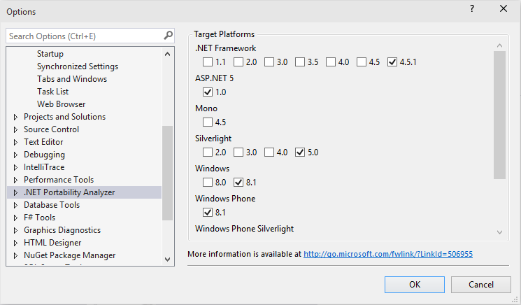
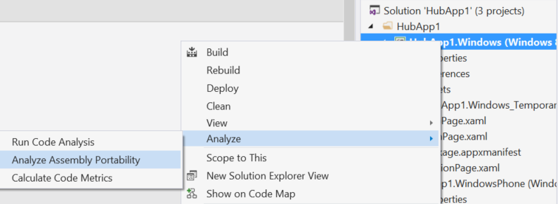
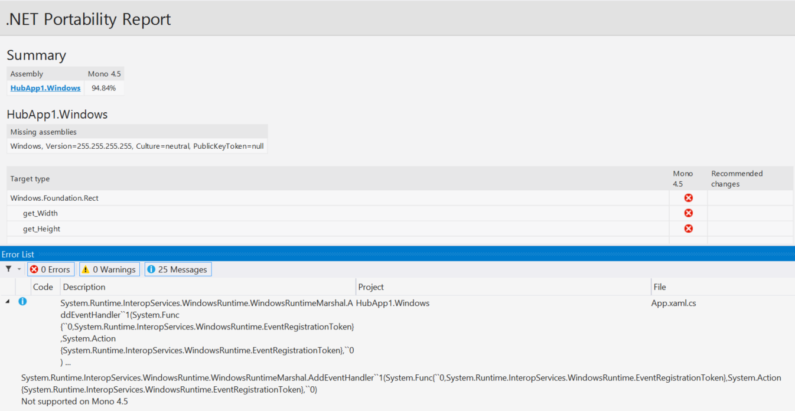

Herstellen der Kompatibilität mit .NET Core- und anderen Plattformen .NET von Bibliotheken
==========================================================================================

Möchten Sie Ihre Bibliotheken Multiplattform machen?
Erfahren Sie, wie viel Arbeit ist möchten
erforderlich, um Ihre Anwendung mit anderen Plattformen .NET kompatibel zu machen?
Die [.NET Portabilität
Analyzer](https://visualstudiogallery.msdn.microsoft.com/1177943e-cfb7-4822-a8a6-e56c7905292b)
ist ein Tool, das Sie einen ausführlichen Bericht über wie flexibel bietet die
Programm ist plattformübergreifend .NET durch das Analysieren von Assemblys.
Die
Portabilität Analyzer wird angeboten, als Visual Studio-Erweiterung und einen
Konsolen-app.

Neue Ziele
----------

-   [.NET Core 5](https://www.dotnetfoundation.org/netcore5): verfügt über eine
modulare Design beschäftigt Side-by-Side und Ziele
Plattformübergreifende Szenarien.
   Seite-an-Seite können Sie neue .NET eingesetzt
Core-Versionen, ohne dass andere apps.
-   [ASP.NET 5](https://www.dotnetfoundation.org/aspnet-5): ist eine moderne
Web-Framework baut auf .NET Core 5, sodass Entwickler die
dieselben Vorteile.
-   [.NET
Native](http://blogs.msdn.com/b/dotnet/archive/2014/04/24/dotnetnative-performance.aspx):
Verbessern der Leistung von Windows Store-apps, die auf X 64 ausgeführt und
ARM-basierten Computern mithilfe von .NET Native statische Kompilierung.

Wie Sie Portabilität Analyzer
-----------------------------

Laden Sie die Erweiterung zunächst mit dem .NET Portabilität Analyzer
aus der Visual Studio Gallery.
Sie können es in Visual Studio konfigurieren.
über *Tools* & Gt; & Gt; *Optionen* & Gt; & Gt; *.NET Portabilität Analyzer* und
Wählen Sie die Zielplattformen.
Jetzt verwenden Sie ASP.NET 5 als proxy
für alle .NET Core 5-basierten Plattformen (z. B. [Windows 10 .NET UAP
apps](http://blogs.windows.com/buildingapps/2015/03/02/a-first-look-at-the-windows-10-universal-app-platform/)).

Um das gesamte Projekt analysieren, Maustaste auf das Projekt in der
Projektmappen-Explorer und wählen Sie *Analysieren* & Gt; & Gt; *Analysieren der Assembly
Portabilität*.
Andernfalls fahren Sie mit dem Menü "Analyse", und wählen Sie *Analysieren
Assembly-Portabilität*.
Wählen Sie dort Ihr Projekt ausführbare Datei oder
DLL-Datei.

Nach dem Ausführen der Analysis, sehen Sie Ihren .NET Portabilität Bericht.
Nur Typen, die von der Zielplattform nicht unterstützt werden werden angezeigt, der
Liste, und Sie können überprüfen, Vorschläge in die **Nachrichten** Registerkarte der
**Fehlerliste**.
Sie können auch auf Problembereiche direkt von Wechseln der
**Nachrichten** Registerkarte.

Möchten Sie Visual Studio verwenden?
Sie können auch die Portabilität
Analyzer von der Befehlszeile aus.
Herunterladen des Befehlszeilen-Analyzers
[here](http://www.microsoft.com/en-us/download/details.aspx?id=42678).

-   Geben Sie den folgenden Befehl aus, um das aktuelle Verzeichnis zu analysieren:
`\...\ApiPort.exe.`
-   Geben den folgenden Befehl, um analysieren eine bestimmte Liste von DLLs:
`\...\ApiPort.exe first.dll second.dll third.dll`

.NET Portabilität Bericht wird als in Excel XLSX-Datei gespeichert werden
das aktuelle Verzeichnis.
Die **Details** wird auf der Excel-Arbeitsmappe
enthält weitere Informationen.

Lesen Sie weitere Informationen zu den .NET Portabilität Analyzer, [Dies
Artikel](http://blogs.msdn.com/b/dotnet/archive/2014/08/06/leveraging-existing-code-across-net-platforms.aspx).

